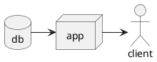

{:.no_toc}
1. this unordered seed list will be replaced by toc as unordered list
{:toc}

## **분자구조식**

---

#### 그려주는 패키지

- [chemfig](https://ctan.org/pkg/chemfig)
- [ochem](https://ctan.org/pkg/ochem)
- [streeTeX](https://ctan.org/pkg/streetex)
- [XyMTeX](https://ctan.org/pkg/xymtex)
- [PPCHTeX](https://wiki.contextgarden.net/Chemistry)

### LaTex Math Symbols

#### Math Mode Accents

-|LaTeX|-|LaTeX|-|LaTeX|-|LaTeX
---|---|---|---|---|---|---|---
$$\hat{a}$$ | \hat{a} | $$\check{a}$$ | \check{a} | $$\tilde{a}$$ | \tilde{a} | $$\acute{a}$$ | \acute{a} 
$$\grave{a}$$ | \grave{a} | $$\dot{a}$$ | \dot{a} | $$\ddot{a}$$ | \ddot{a} | $$\breve{a}$$ | \breve{a} 
$$\bar{a}$$ | \bar{a} | $$\vec{a}$$ | \vec{a} | $$\widehat{A}$$ | \widehat{A} | $$\widetilde{A}$$ | \widetilde{A} 

$$\\
\xleftarrow{{}} \\
\leftarrow \\ $$

$$e^{ix} = \cos{x} + i\sin{x}$$
$$C_2H_5OH \rightarrow CH$$

$$\hat{a}$$
$$\check{a}$$

$$Y=W{x}+b$$

