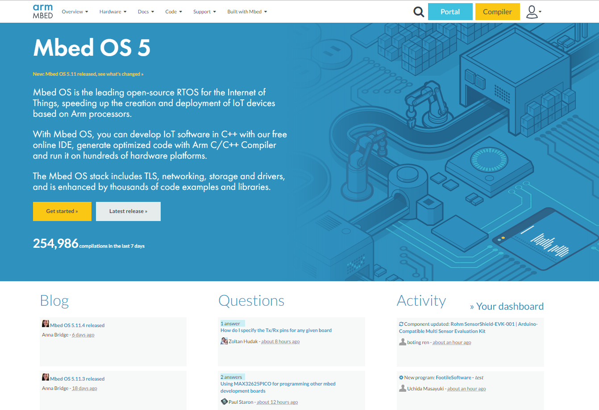

# Mbed
Mbed is a platform and operating system for internet-connected devices based on 32-bit ARM Cortex-M microcontrollers. Such devices are also known as Internet of Things devices. The project is collaboratively developed by Arm and its technology partners. [`mbed OS`](https://os.mbed.com/) [`wiki`](https://en.wikipedia.org/wiki/Mbed)  




### Table of Contents
{:.no_toc}
1. this unordered seed list will be replaced by toc as unordered list
{:toc}

### Mbed 가입하기

Mbed 사이트 접속
```bash
https://os.mbed.com/
```

1. install git 
```console
https://git-scm.com/download/win
```
2. GCC Path
```console
\> mbed config –G GCC_ARM_PATH “C:\Program Files (x86)\GNU Tools ARM
Embedded\6 2017-q2-update\bin”
```

3. Toolchain Path
```console
\> mbed config -G TOOLCHAIN "GCC_ARM“
```

4. cmd 프롬프트를재실행하고, 프로젝트를가져옵니다.
```console
\> mbed import http://github.com/ARMmbed/mbed-os-example-blinky
\> cd mbed-os-example-blinky
\> mbed config TARGET "NUCLEO_F429ZI"
\> mbed compile
```
