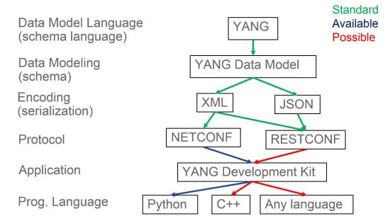

# netconfig

## Table of Contents
{:.no_toc}
0. this unordered seed list will be replaced by toc as unordered list
{:toc}

## libyang
```bash
$ git clone https://github.com/CESNET/libyang.git
$ mkdir build; cd build
$ cmake ..
$ make
# make install
```

## pyang
```bash
# git clone https://github.com/mbj4668/pyang.git
# pip install pyang
$ pyang -f tree --hello hello.xml
https://github.com/mbj4668/pyang/wiki/Tutorial
```
## yang namespace
```bash
https://tools.ietf.org/html/rfc6020
apt-get install libxml2-utils
pip install paramiko
https://blogs.cisco.com/getyourbuildon/yang-opensource-tools-for-data-modeling-driven-management
```


