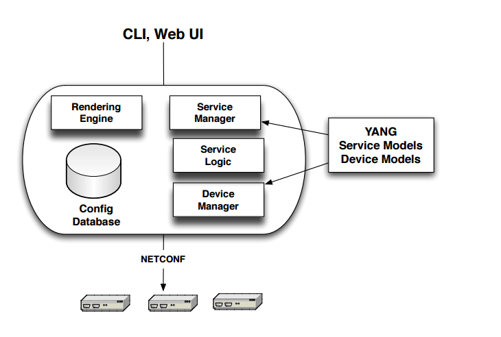

# Why use NETCONF/YANG when you can use SNMP and CLI?
[original article](https://snmpcenter.com/why-use-netconf/)  

The main usage of NETCONF is to configure devices. But wait! We have been doing that for many-many years and we know the advantages and disadvantages of using SNMP and CLI to configure devices and networks. Do we really need  another protocol?

To answer that question, let’s take a closer look to CLI and SNMP disadvantages

### Important CLI limitations
CLI scripting is the primary approach to making automated configuration changes to the network, at least prior to NETCONF.

Unfortunately, CLI scripting has various limitations and the most important one is the lack of transaction management. Configuring a device maybe a complex task, involving multiple actions i.e. configuration changes, that need to take place.

Usually these multiple actions can not be done partially, as this would leave the device in an undefined state. In case one action fails, we need to rollback, i.e. undo all previous actions. This requires extensive programming when transaction management is not supported and this is the case with CLI.

**Lack of structured error management** is the second big issue of CLI. Usually whenever a new device software is released, new CLI commands are added but unfortunately in some cases existing commands are modified or deleted. This means that every other software that was using CLI as an application programming interface (API) will fail, and most probably without gracious handling of the errors.

This **ever changing structure and syntax** of CLI commands is what makes CLI scripts fragile and costly to maintain. These are all side-effects of the basic fact that CLIs are designed to be used by humans and not an API for programmatic access.

### SNMP complexity disadvantages
SNMP was developed to be used for both monitoring and management, i.e. it has the capability to write changes. So why is SNMP mostly used for fault and performance monitoring and not configuration changes?

The main reasons for this is the complexity of SNMP and therefore the inherent lack of a standard automatic discovery process that finds the (correct) MIB modules that the device is using. This means that the discovery work must be done by the users or operators and as it is complex, configuration management with SNMP has been abandonded.

The disadvantages inherent in the use of the UDP protocol where messages can be just lost, and the lack of useful standard security and commit mechanisms have also played a significant role in the replacement of SNMP with CLI for configuration of devices.

### Key NETCONF Capabilities

The key with NETCONF protocol is that it was designed to address the shortcomings of existing practices and protocols for configuration management including:

* Distinction between configuration and state data
* Multiple configuration data stores (candidate, running, startup)
* Configuration change transactions
* Configuration testing and validation support
* Selective data retrieval with filtering
* Streaming and playback of event notifications
* Extensible procedure call mechanism

### But is NETCONF really being used to configure devices?
According to an article of LightReading, even from 2013 there has been a major rush from many of the major vendors to support NETCONF and YANG as part of the rush to, at least publicly, embrace “open networks. Among the supporters were Brocade Communications Systems Inc.  Cisco Systems Inc., Juniper Networks Inc., Ericsson-LG , and Nokia Networks , but notably not Alcatel-Lucent.

But what is the benefit of NETCONF that outweighs the cost of replacing existing protocols? The operator’s target is to get humans out of the loop of configuration management, as it has been estimated that up to 60% of configuration errors are due to humans mistyping things or translating things wrong from print to their console.

### Summary
NETCONF’s development began in the IETF way back in 2003, as network operators realized that SNMP while widely deployed, was inadequate for network configuration and that individual vendor CLIs can’t easily be programmed for automation and require human interpretation.

NETCONF’s adoption had been slow, but with the emergence of SDN/NFV, NETCONF is the (only) cadidate to replace CLI for configuration management of programmable networks.

